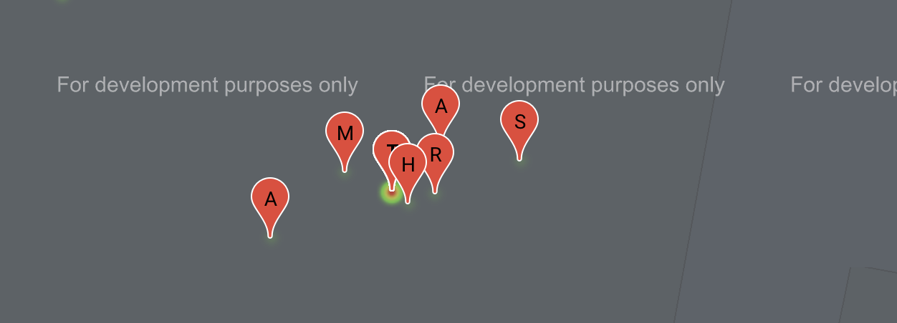

# Covid-19 Tracker

## How to run
- Download The Project by either cloning it using git clone or the direct GitHub Download
- cd into the project directory
- Run the following command to install the project dependencies
    > npm i
- To start the project, run the following command in the terminal
    > npm start
- The project by default will run on port 3000

<hr />

## Project Folder Structure

```
Application
│   public
│
└───src
│   │
│   └───components
└───pages
    
```
 
- The src folder contains the componenets that are the building blocks for the pages of the website
- The pages folder contains the website's pages

<hr />

## Technologies Used:
- React and Material UI
- Firebase real time database for storing the entries
- Google maps

<hr />

## Project Routes: 
- /
  - This is the route for the data entry where the user enters their data to be stored in the firebase real time database
  - Screenshot: 


- /dashboard
  - This is the route for the dashboard where all the patients are displayed on the map with a heatmap layer indicating the density of patients in the areas
  - Screenshot:


<hr />

## Notes
- The warning displayed in the console for the findDOMNode is due to a github issue in the material ui package used for components which is yet unresolved, the github issue can be found here: https://github.com/mui-org/material-ui/issues/20561 and a screenshot of the warning:

- The "You must enable billing on the google cloud project" warning is due to using the google maps API without activating a billing bank account in the gmail account used, as google maps here is only intended for development and not for production purposes
- The Google Maps popup "This page can't load Google Maps correctly." and the dark layer on the maps interface with the "For deveoplment purposes only" are present due to the use of the google maps API without a billing account as well, and a screenshot of the mention popup:


- I have already entered some data in the database which will appear as markers on the map, but their location is at my own home as the project uses the location information it got from the browser.
- The heatmap layer for the hotspots requested for the project are displayed as a heatmap under the markers, a screenshot of an example will provided: 

- When viewing the patients on the map after entering the data, since the browser uses the current location, the markers will probably stack overeach because of the use of the same data location as mentioned, so I added the first letter of the first name as a label on the marker for clarity as shown in the screenshot below:
